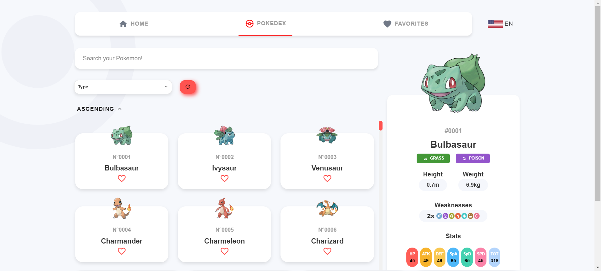

# Pokémon Pokedex Application - README

Welcome to the Pokémon Pokedex Application! This project is a web-based app built with Nuxt.js and Vue.js that allows users to explore and interact with Pokémon data. It features three main pages: Home, Pokedex, and Favorites, as well as support for internationalization (i18n) with multiple languages.

---

## Table of Contents
1. [Overview](#overview)
2. [Features](#features)
3. [Project Setup](#project-setup)
4. [Pages](#pages)
   - [Home Page](#home-page)
   - [Pokedex Page](#pokedex-page)
   - [Favorites Page](#favorites-page)
5. [Internationalization](#internationalization)
6. [Technologies Used](#technologies-used)
7. [Getting Help](#getting-help)

---

## Overview
The Pokémon Pokedex Application is designed to provide a user-friendly interface for browsing Pokémon information. Users can search for Pokémon, view detailed statistics, and manage their favorite Pokémon list. The app supports multiple languages, making it accessible to a global audience.

## Features
- **Three main pages**: Home, Pokedex, and Favorites.
- **Internationalization (i18n)**: Support for multiple languages, including English and Portuguese.
- **Dynamic Pokémon data**: Fetches and displays data from an external API.
- **Favorites management**: Allows users to save their favorite Pokémon.
- **Responsive design**: Optimized for mobile and desktop views.

## Project Setup
To set up this project locally, follow these steps:

1. **Install Dependencies**:
   ```bash
   npm install
   ```

2. **Run the Development Server**:
   ```bash
   npm run dev
   ```

3. **Build the Application for Production**:
   ```bash
   npm run build
   ```

4. **Start the Production Server**:
   ```bash
   npm start
   ```

## Pages

### Home Page
- **Description**: The home page provides an introduction to the Pokémon Pokedex Application and an overview of its features.
- **Components**: Navbar with navigation to other pages and a brief description of the app.
- **Purpose**: To serve as a starting point for users to explore the app's functionalities.

<p align="center">
  
  
</p>

### Pokedex Page
- **Description**: The Pokedex page allows users to search and filter through the list of Pokémon.
- **Features**:
  - **Search bar**: Allows users to search for Pokémon by name or ID.
  - **Sorting options**: Users can sort Pokémon in ascending or descending order.
  - **Detailed view**: Clicking on a Pokémon displays detailed stats and evolution information.
- **Components**: Search bar, Pokémon list, Pokémon detail modal.
- **Purpose**: To enable users to browse and interact with the complete list of Pokémon.

<p align="center">
  
  
</p>

### Favorites Page
- **Description**: The Favorites page displays a list of Pokémon that the user has marked as favorites.
- **Features**:
  - **Favorites management**: Users can add or remove Pokémon from their favorites list.
  - **Responsive layout**: Optimized for both mobile and desktop views.
- **Components**: Favorites list, Pokémon detail view.
- **Purpose**: To provide quick access to a user's favorite Pokémon.

<p align="center">
  
  
</p>

## Internationalization
- **Description**: The application supports internationalization (i18n) using the `@nuxtjs/i18n` module.
- **Supported Languages**: English (en) and Portuguese (pt).
- **Language Toggle**: Users can switch between languages using a button on the navbar.

## Technologies Used
- **Frontend Framework**: Nuxt.js with Vue.js 3.
- **State Management**: Pinia for managing application state.
- **UI Framework**: Vuetify for component-based UI design.
- **Internationalization**: @nuxtjs/i18n for multi-language support.
- **CSS Preprocessing**: SCSS for styling.

## Getting Help
If you encounter any issues or have questions about the application, feel free to reach out through GitHub issues or contact the project maintainer.
